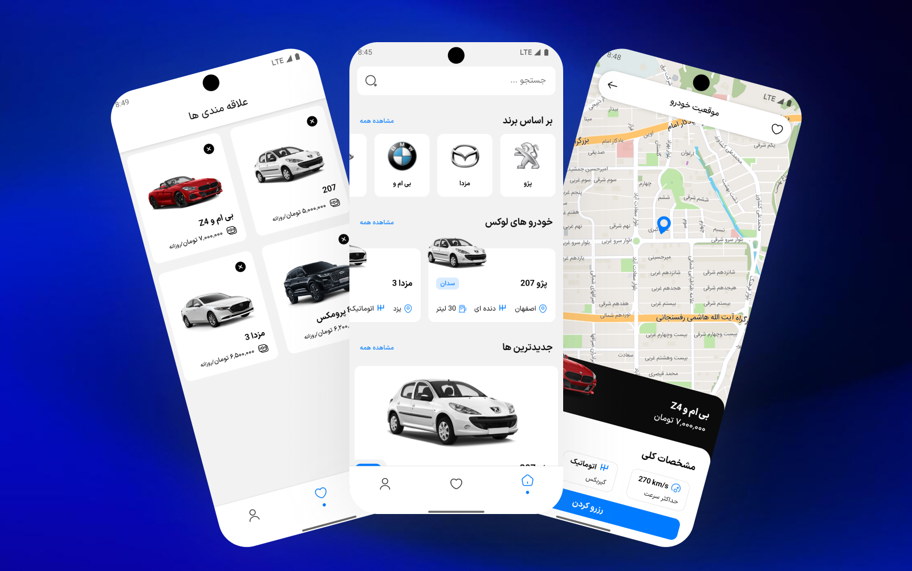

# 🚗 CarRental – React Native App

<!-- Tech badges -->




CarRental is a **demo mobile application** built with **React Native (v0.81.4)** without Expo.  
It showcases a modern app structure with bottom tab navigation, state management using Redux Toolkit, and open-source map integration via MapLibre.  
The project is designed purely for **portfolio and demonstration purposes**, focusing on clean UI, modular architecture, and best practices in React Native development.

---

## 📥 Download APKs

Download the APK for your device architecture:

[](https://github.com/HoseinPirhadi/CarRental/releases/download/v1.0.0/app-arm64-v8a-release.apk)
[](https://github.com/HoseinPirhadi/CarRental/releases/download/v1.0.0/app-armeabi-v7a-release.apk)

---

## 📱 Features

- Main screen with **Bottom Navigation**:
  - **Home:** Display a list of cars (FlatList) with navigation to detail screen
  - **Favorites:** Manage favorite cars with persistence
  - **Profile:** Show user statistics (reservations, membership, score) and settings
- Car detail screen with images and information
- Local storage with persistence for favorites
- Clean and modular design

---

## 🛠️ Key Technologies

- **React Native (v0.81.4)** – Cross-platform mobile development
- **React Navigation (Bottom Tabs + Native Stack)** – Page and tab navigation
- **Redux Toolkit + Redux Persist** – State management with data persistence
- **MapLibre React Native** – Open-source maps without Google Maps

---

## 🚀 Getting Started

Follow the steps below to clone and run the project locally:

```bash
# Clone the repository
git clone https://github.com/HoseinPirhadi/CarRental.git

# Navigate into the project directory
cd CarRental

# Install dependencies
npm install

# Run on Android
npx react-native run-android
```

## 📌 Notes

- This project has **no backend** and is intended solely for frontend demonstration.
- Built with a **modular and scalable architecture** to simplify maintenance and future enhancements.
- Uses **MapLibre** for open-source map integration instead of commercial mapping services.
